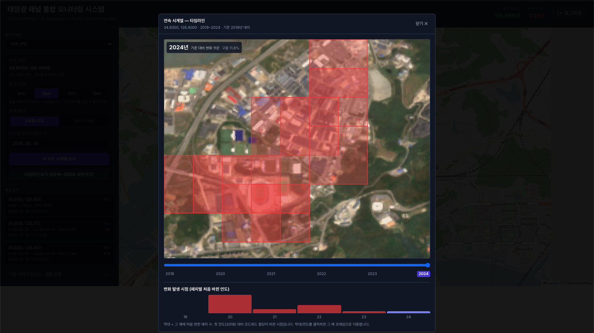
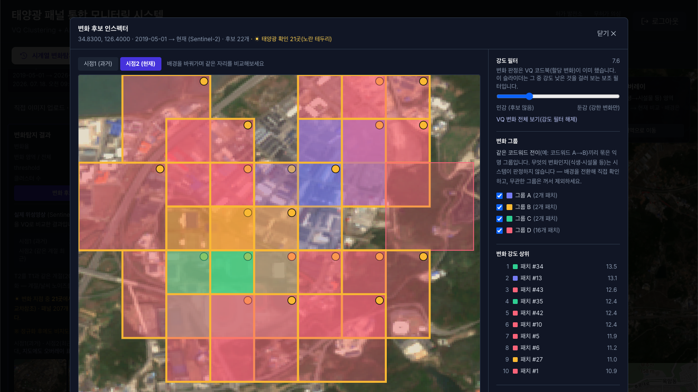
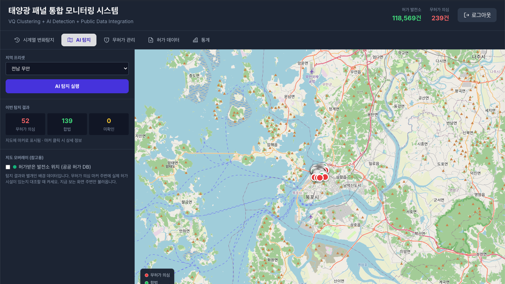
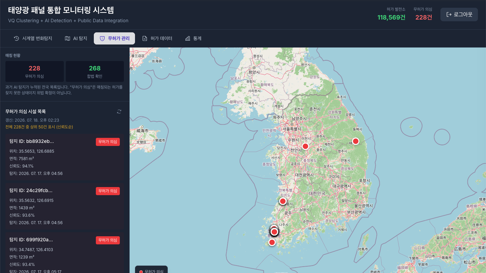

<!-- language switch -->
[🇰🇷 한국어](./README.md) · **🇺🇸 English**

# VQ Satellite Time-Series Change Detection · Solar Monitoring

A web service that detects **time-series change** in satellite imagery using Vector Quantization (VQ) codebooks, and **cross-verifies solar installations** with high-resolution aerial imagery + YOLOv8. It pulls Sentinel-2 from Google Earth Engine and sweeps a single location across multiple years to show *where, when, and how* it changed.

> Personal portfolio / research project. Google Earth Engine and Korean public data are used under their own terms of service (GEE within its free, non-commercial tier).

---

## Features

### 1. Continuous (multi-temporal) VQ change detection
- Fetches a single coordinate across **multiple years (same season)** and trains **one shared VQ codebook** over all of them.
- Quantizes each timepoint to codewords, and treats a patch as *changed* when its **codeword assignment changes** — the VQ codebook is what drives the decision (not raw pixel differencing).
- A timeline slider scrubs through years to reveal cumulative change, and a "first-change-year per patch" distribution shows **when** each change happened.

### 2. Seasonal / weather noise normalization
- **Seasonal alignment**: the comparison timepoint is auto-matched to the same season (same month), removing vegetation-phenology differences.
- **Radiometric normalization**: brightness/contrast is aligned across frames so illumination and atmospheric haze aren't mistaken for change.

### 3. YOLO cross-reference — honest semantic labels
- VQ never *guesses* what a change is (it's unsupervised). Instead, YOLOv8 runs on the same location's **high-resolution aerial imagery (VWorld)** to detect solar panels; where a detection overlaps a VQ change patch, it's marked **"solar confirmed"** — a measurement from an independent model, not a guess.

### 4. AI solar detection · permit matching
- YOLOv8-seg detects solar panels and matches them against public permit data (~110k records) to **screen for unpermitted** installations (a signal, not a verdict).
- Slope / forest / water-based risk scoring (advisory), nationwide statistics.

### 5. Result persistence
- Each analysis (1–2 min) is saved so it survives a refresh, and the **"recent runs"** list re-displays it instantly with one click.

---

## Screenshots

| Continuous timeline | Change inspector (solar markers) |
|---|---|
|  |  |

| AI detection map | Permits / unpermitted management |
|---|---|
|  |  |

---

## Architecture

```
Next.js 14 (frontend)  ──►  FastAPI (backend)  ──►  PostgreSQL/PostGIS
                                 │
                                 ├─► Celery + Redis (async: VQ pipeline, sync)
                                 ├─► Google Earth Engine (Sentinel-2 time-series)
                                 ├─► VWorld (hi-res aerial · forest-site data)
                                 └─► YOLOv8-seg (solar detection) · ResNet50 (features)
```

**Stack**: Next.js 14 · TypeScript · Tailwind / FastAPI · SQLAlchemy 2.0 · Celery 5 / PostgreSQL + PostGIS · Redis / PyTorch 2.2 · ultralytics (YOLOv8) · scikit-learn · earthengine-api

---

## Technical highlights

- **The VQ codebook drives the change decision** — a shared codebook quantizes two (or N) timepoints into one vocabulary; change = assignment change. It actually delivers on the project's namesake.
- **Honest unsupervised boundaries** — it does not classify *what* changed; only solar is labeled, and only from an independent YOLO measurement. No pretending to know what it doesn't.
- **PostGIS spatial matching** — ST_DWithin + GIST index for panel-permit matching.
- **Idempotent data sync** — weekly public-permit sync (full replace + re-match, transaction + SAVEPOINT).

---

## Quick start

### Prerequisites
- Docker & Docker Compose
- Google Earth Engine service-account key (`backend/gee-service-account.json`) — free for non-commercial use
- VWorld · data.go.kr API keys

### Run
```bash
# 1) create .env at the repo root (see below)
# 2) place the GEE service-account key at backend/gee-service-account.json
# 3) start
docker compose up -d
# frontend: http://localhost:3002 · API docs: http://localhost:8000/api/docs
```

Key `.env` entries:
```bash
POSTGRES_USER=...  POSTGRES_PASSWORD=...  POSTGRES_DB=...
SECRET_KEY=<strong random value>
VWORLD_API_KEY=...  VWORLD_REQUEST_DOMAIN=localhost
SOLAR_PERMIT_API_KEY=...  SOLAR_PERMIT_API_URL=...
```

> Note: after first boot you need to run DB migrations (`database/migrations/*.sql`) and import permit data.

---

## Project layout

```
backend/        FastAPI · Celery tasks · services (GEE·VWorld·YOLO·matching)
ml-service/     VQ codebook · feature extraction · change-detection processors
frontend/       Next.js 14 dashboard (5 tabs)
database/       PostGIS migrations
docs/images/     README screenshots
```

---

## Limitations · disclaimer

- As **unsupervised** change detection, some residual seasonal/vegetation change may remain even after normalization. It does not classify the *type* of change (except solar, via an independent YOLO measurement).
- **"Unpermitted (suspected)" is a screening signal, not a legal determination** (it's the result of a failed match). Do not use it as grounds for administrative action.
- **GEE is used only within its free, non-commercial tier.** Commercial use requires a separate license.
- There is no quantitative accuracy evaluation (precision/recall against ground truth) yet — behavior is verified, but accuracy figures are unmeasured.

---

## License

**AGPL-3.0** — [ultralytics (YOLOv8)](https://github.com/ultralytics/ultralytics), the core detection model, is AGPL-3.0; as a combined work this repository is distributed under the same license. See [NOTICE.md](./NOTICE.md) for per-dependency licenses and external data terms.
